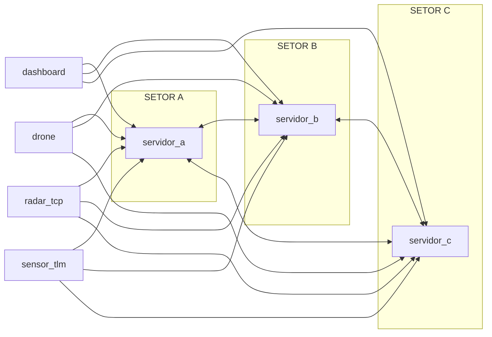

# PBL 2 - Redes: Desbloqueio do Estreito de Ormuz

Projeto da disciplina de Conectividade e Concorrência com arquitetura distribuída orientada a eventos, usando Go, TCP/UDP e Docker.

Este repositório modela uma rede de vigilância marítima com servidores de setor em malha P2P, sensores, drones e painel de operação. A versão atual já está modularizada no servidor e inclui filas com prioridade, producer-consumer e documentação separada por assunto.

## Documentação oficial

Esta README funciona como página principal. Para navegação técnica, use o portal em [docs/README.md](docs/README.md).

- [docs/README.md](docs/README.md) - portal da documentação técnica.
- [docs/REFACTORING_README.md](docs/REFACTORING_README.md) - índice geral da refatoração e quick start.
- [docs/REFACTORING_SUMMARY.md](docs/REFACTORING_SUMMARY.md) - resumo executivo da entrega.
- [docs/MODULARIZATION_CHANGELOG.md](docs/MODULARIZATION_CHANGELOG.md) - explicação da modularização, fila e fluxo.
- [docs/TESTING_GUIDE_v2.md](docs/TESTING_GUIDE_v2.md) - testes unitários, integração e stress.
- [docs/CODE_REVIEW_GUIDE.md](docs/CODE_REVIEW_GUIDE.md) - guia de leitura do código por módulo.
- [docs/FINAL_REPORT.md](docs/FINAL_REPORT.md) - relatório final da implementação.
- [docs/FILE_INDEX.txt](docs/FILE_INDEX.txt) - mapa rápido dos arquivos.

## Visão geral

O sistema separa infraestrutura de rede, consenso distribuído e operação:

- Servidores de setor em [servidor/](servidor) mantêm estado local, participam da malha P2P e coordenam despacho de drones.
- Dashboard em [dashboard/](dashboard) monitora frota, telemetria e alertas, e também envia despacho manual.
- Drones em [drone/](drone) registram-se no servidor e executam missões.
- Radar em [radar_tcp/](radar_tcp) envia eventos críticos via TCP.
- Telemetria em [sensor_tlm/](sensor_tlm) envia leituras contínuas via UDP.

A arquitetura suporta um ou vários setores, com failover de cliente por lista de endereços (`SERVER_ADDRS`) e sincronização P2P entre servidores.

## Como o sistema atua

O fluxo principal é o seguinte:

1. O sensor ou painel gera um evento.
2. O servidor enfileira o alerta em uma fila com prioridade.
3. Uma goroutine consumidora retira o próximo item da fila.
4. O servidor inicia a exclusão mútua de Ricart-Agrawala.
5. Quando o consenso é alcançado, o despacho é enviado ao drone local ou remoto.
6. O gossip replica a frota entre setores e dashboards.

Esse desenho evita perda de alerta quando o servidor está ocupado e permite separar entrada de eventos do processamento do despacho.

## Arquitetura



Notes:

- O tráfego entre servidores usa a porta `48084/tcp`.
- Os clientes usam `SERVER_ADDRS` para failover round-robin.

## Componentes e papéis

### Servidor
- Recebe telemetria UDP na porta `48080`.
- Recebe eventos TCP na porta `48081`.
- Recebe drones na porta `48082`.
- Recebe dashboard na porta `48083`.
- Mantém a malha P2P na porta `48084`.
- Coordena despacho com Ricart-Agrawala.
- Usa fila de alertas com prioridade e starvation prevention.

### Dashboard
- Mantém conexão TCP com o servidor de setor.
- Exibe frota global, telemetria e alertas.
- Permite solicitar missão manual.
- Faz failover automático entre servidores da lista.

### Drone
- Registra-se com `REG` e publica estado com `ACK`.
- Recebe `CMD` de despacho e simula missão.
- Faz failover automático entre servidores da lista.

### Radar TCP
- Publica eventos críticos com `EVT` via TCP.
- Pode representar radar, AIS ou sensor químico.

### Sensor TLM
- Publica telemetria `TLM` via UDP.
- Recria socket e alterna servidor em falha de envio.
- Agora usa intervalo de 2 segundos para reduzir saturação.

## Tecnologias utilizadas

- Linguagem: Go 1.25.
- Transporte: TCP e UDP.
- Serialização: JSON.
- Concorrência: goroutines, mutexes e `sync.Cond`.
- Consenso distribuído: Ricart-Agrawala.
- Sincronização de estado: gossip P2P.
- Padrão de fluxo: producer-consumer.
- Containerização: Docker.
- Orquestração local: Docker Compose.

## Algoritmos e mecanismos

### Lamport
O relógio lógico ordena eventos distribuídos e ajuda a comparar requisições entre setores.

### Ricart-Agrawala
Garante exclusão mútua entre setores para despacho de drones.

### Gossip
Replica o estado da frota entre servidores e dashboards para reduzir divergência de visão.

### Producer-consumer
Separa o recebimento de alertas do processamento de despacho, reduzindo perda em momentos de carga.

### Fila com prioridade
- Alerta crítico entra na fila crítica.
- Alerta normal entra na fila normal.
- Após 3 ciclos críticos, um alerta normal é promovido para evitar starvation.

## Mensagens principais

- `REG`: registro de componente.
- `CMD`: comando de despacho.
- `ACK`: confirmação e estado de drone.
- `EVT`: evento crítico de sensor.
- `TLM`: telemetria numérica.
- `P2P_HELLO`: descoberta de vizinho.
- `P2P_REQ`: pedido de exclusão mútua.
- `P2P_CMD`: ordem remota de despacho.
- `GOSSIP`: sincronização da frota.

Campos usados no JSON, conforme o tipo:

- `tipo`
- `remetente`
- `destino`
- `relogio`
- `acao`
- `valor`
- `posicao`
- `frota`

## Portas

### Servidor por container

| Protocolo | Porta | Uso |
| --- | --- | --- |
| UDP | 48080 | Entrada de telemetria |
| TCP | 48081 | Entrada de eventos |
| TCP | 48082 | Registro e controle de drones |
| TCP | 48083 | Conexão do dashboard |
| TCP | 48084 | Malha P2P entre servidores |

### Exemplo de mapeamento no host

| Setor | UDP 48080 | TCP 48081 | TCP 48082 | TCP 48083 |
| --- | --- | --- | --- | --- |
| A | 48080 | 48081 | 48082 | 48083 |
| B | 8090 | 8091 | 8092 | 8093 |
| C | 8100 | 8101 | 8102 | 8103 |

## Resiliência e falhas

1. Os clientes alternam automaticamente entre servidores de contingência.
2. O `sensor_tlm` tenta o próximo servidor quando ocorre falha de `Write`.
3. As conexões TCP usam keepalive para reduzir conexões zumbis.
4. O gossip mantém a visão da frota convergente entre setores.
5. A exclusão mútua evita disputa concorrente por drones.
6. Em degradação parcial, o sistema continua operando pelos setores restantes.

## Estrutura do projeto

```text
.
├── docker-compose.yml
├── README.md
├── REFACTORING_README.md
├── REFACTORING_SUMMARY.md
├── MODULARIZATION_CHANGELOG.md
├── CODE_REVIEW_GUIDE.md
├── TESTING_GUIDE_v2.md
├── FINAL_REPORT.md
├── FILE_INDEX.txt
├── arquivos_sh/
├── dashboard/
├── drone/
├── radar_tcp/
├── sensor_tlm/
└── servidor/
```

## Como executar

### Com Docker Compose

```bash
docker compose up -d --build
```

### Manual por setor

```bash
NOME_SETOR=SETOR_NORTE ./arquivos_sh/run_servidor.sh
```

Variáveis úteis:

- `NOME_SETOR`
- `PEERS`
- `SERVER_ADDRS`

## Testes de stress

Os scripts em `arquivos_sh/` simulam carga com imagens Docker Hub.

Scripts disponíveis:

- `arquivos_sh/stress_sensores.sh`
- `arquivos_sh/stress_atuadores.sh`
- `arquivos_sh/stress_clientes.sh`
- `arquivos_sh/cleanup.sh`

## Comandos úteis

```bash
docker compose ps
docker ps --format 'table {{.Names}}\t{{.Status}}\t{{.Ports}}'
docker compose down
```

## Fluxo de documentação

Se quiser entender o projeto em camadas, a ordem mais útil é:

1. Ler esta README para visão geral.
2. Abrir [docs/README.md](docs/README.md) para navegar pela documentação técnica.
3. Ler [docs/REFACTORING_README.md](docs/REFACTORING_README.md) para o índice da refatoração.
4. Ler [docs/MODULARIZATION_CHANGELOG.md](docs/MODULARIZATION_CHANGELOG.md) para a arquitetura.
5. Consultar [docs/TESTING_GUIDE_v2.md](docs/TESTING_GUIDE_v2.md) para validação.
6. Usar [docs/CODE_REVIEW_GUIDE.md](docs/CODE_REVIEW_GUIDE.md) para entender o código por módulo.

## Observação sobre documentação oficial

Sim, essa separação é comum em documentação oficial: uma página principal curta e estável, e páginas auxiliares por tema, como arquitetura, testes, release notes e guia de revisão. É exatamente o que este repositório agora segue.

---

## Build & Push de imagens (Docker)

Os seguintes comandos constavam em scripts auxiliares; incluí aqui para facilitar workflows de laboratório.

Build das imagens (na raiz deste repositório):

```bash
docker build -t cleidsonramos/servidor:latest ./servidor
docker build -t cleidsonramos/dashboard:latest ./dashboard
docker build -t cleidsonramos/sensor_tlm:latest ./sensor_tlm
docker build -t cleidsonramos/radar_tcp:latest ./radar_tcp
docker build -t cleidsonramos/drone:latest ./drone
```

Push (envie para seu registry):

```bash
docker push cleidsonramos/servidor:latest
docker push cleidsonramos/dashboard:latest
docker push cleidsonramos/sensor_tlm:latest
docker push cleidsonramos/radar_tcp:latest
docker push cleidsonramos/drone:latest
```

---

## Observacoes finais

- Para ambiente de apresentacao com multiplas maquinas, prefira IP fixo e porta padronizada por setor.
- Se quiser validar apenas um caminho, comece por: `servidor + drone + radar + dashboard`.
- Em cenarios com perda de no, verifique logs de reconexao e de gossip para confirmar convergencia.
