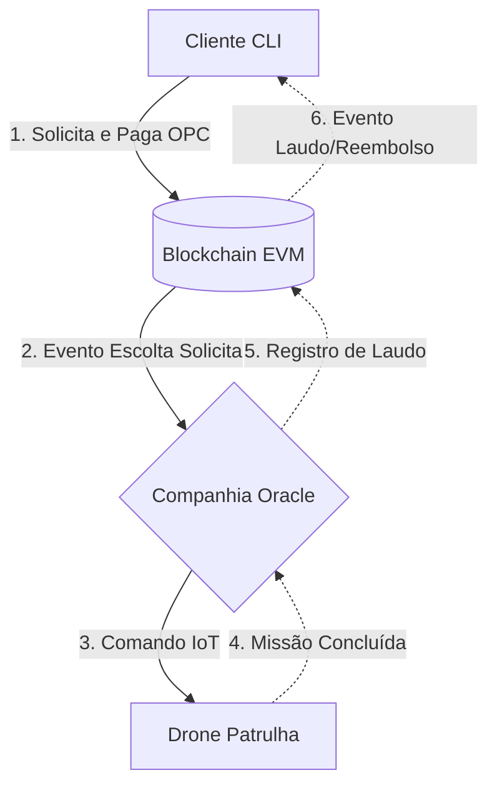

# Ormuz Consortium – Escolta Naval Autônoma

## Resumo Executivo

O Ormuz Consortium é uma plataforma autônoma de segurança marítima que orquestra frotas de Drones de Patrulha através de Contratos Inteligentes (Smart Contracts). O sistema conecta a solicitação de missões e sua respectiva liquidação financeira a atuações IoT (Internet of Things) no mundo físico, operando em um ecossistema *trustless* onde a confiabilidade repousa na Blockchain e não em intermediários humanos.

## Visão Geral

A arquitetura do projeto é segregada em componentes estritos e especializados:

* **Blockchain (EVM):** Ambiente de liquidação contínua que garante a custódia das transações e dita o estado global do sistema de forma imutável.
* **Smart Contracts:** Regras de negócio programadas em Solidity que implementam o bloqueio de fundos e a cobrança automática de prazos operativos.
* **Cliente CLI:** Interface tática interativa construída em TypeScript que permite às empresas logísticas contratar escoltas, acompanhar eventos on-chain e exigir o ressarcimento financeiro em casos de inatividade.
* **Companhia Oracle:** Servidor operacional desenvolvido em Go. Atua primariamente como uma ponte de leitura/escrita, extraindo ordens validadas da Blockchain para emitir despachos para as frotas reais.
* **Drones Patrulha:** Atuadores de borda responsáveis por receber instruções exclusivas da Companhia Oracle e reportar *Acknowledge* (ACK) de conclusão de patrulhamento no domínio físico.

## Fluxo Operacional

O ciclo de vida completo de uma operação naval transcorre nas seguintes etapas:

1. **Contratação:** A empresa utiliza o Cliente CLI para requisitar a escolta, pagando a taxa estipulada no token nativo da rede (OPC).
2. **Escrow (Bloqueio):** O Smart Contract recebe e bloqueia os OPCs internamente, recusando-se a repassar os fundos imediatamente à prestadora do serviço.
3. **Emissão de Evento:** A Blockchain emite um evento criptográfico anunciando globalmente o requerimento de escolta.
4. **Captura:** A Companhia Oracle capta o evento assíncrono oriundo da Blockchain.
5. **Despacho:** A Companhia sinaliza e engatilha a decolagem do Drone Patrulha de prontidão.
6. **Auditoria (Laudo):** O Drone informa a conclusão física da missão. A Companhia Oracle assina e injeta a transação de "Laudo Concluído" de volta à Blockchain.
7. **Liquidação Financeira:** Com o laudo validado, o Smart Contract autoriza a liberação dos fundos do Escrow para a tesouraria da prestadora.

## Arquitetura

O diagrama a seguir exibe o fluxo de comunicação de sentido único e retorno operacional da plataforma:



## Segurança e Confiabilidade

A rede utiliza paradigmas de proteção rigorosos contra falhas de infraestrutura e agentes mal-intencionados:

* **Escrow:** Todo recurso financeiro permanece travado pela Blockchain. Drones não se movem sem pagamento prévio garantido, e Companhias não faturam sem entregar laudos atestados.
* **Timeout:** Se uma missão contratada falhar em reportar seu laudo dentro de uma janela de blocos pré-definida, ela expira irreversivelmente.
* **Reembolso:** Missões expiradas por *Timeout* dão ao Cliente o poder exclusivo de invocar a devolução integral dos tokens parados no *Escrow*.
* **Imutabilidade e Auditoria:** Não há banco de dados central. Todas as operações logísticas podem ser auditadas por qualquer nó conectado à Blockchain.
* **Proteção contra Operador Malicioso:** É matematicamente inviável à Companhia Oracle sacar fundos inventando IDs de missão irreais ou cobrando múltiplas vezes pela mesma atividade.
* **Proteção contra Pagamentos Indevidos:** A Blockchain anula transações que não possuam saldo suficiente, protegendo a rede contra falsas requisições (Spam).

## Estrutura do Repositório

```text
ormuz/
├── blockchain/      # Ambiente Hardhat, Smart Contracts (Solidity) e scripts de Deploy.
├── client_cli/      # Aplicação TS (Dashboard da Empresa) e Simulador automatizado.
├── servidor/        # Código-fonte da Companhia Oracle (Go) que escuta a EVM.
├── drone/           # Código-fonte do atuador físico (IoT Edge).
├── docs/            # Documentação técnica profunda e detalhamento dos fluxos econômicos.
└── arquivos_sh/     # Ferramental DevOps (Integração e Deploy Contínuo).
```

## Execução Local

1. **Hardhat Node:**
   Suba a Blockchain localmente:
   ```bash
   cd blockchain
   npm install
   npx hardhat node
   ```
2. **Deploy e Bindings:**
   Em um segundo terminal, instaure o Smart Contract e crie as interfaces de comunicação para o Go:
   ```bash
   cd blockchain
   npx hardhat ignition deploy ignition/modules/OrmuzConsortium.ts --network localhost
   ./generate_abi.sh
   ```
3. **Companhia Oracle:**
   Inicie o motor operacional na raiz do servidor:
   ```bash
   cd servidor
   go run main.go types.go queue.go listeners.go
   ```
4. **Cliente CLI:**
   Acione o painel tático das empresas contratantes:
   ```bash
   cd client_cli
   npm install
   npm run start
   ```

## Execução Docker

Para simplificar o levantamento de toda a plataforma de forma enjaulada, execute o pipeline de orquestração automatizado:

```bash
# Sobe a Blockchain, a Companhia Oracle e dois Drones Patrulha
docker compose up -d

# Aguarda a estabilização da EVM e executa as demonstrações operacionais simuladas
./arquivos_sh/start_demo.sh
```

## Operação Distribuída

Para arquitetar uma implantação de rede dividida (Componentes executados fisicamente em máquinas de laboratório distintas), devem-se ajustar as seguintes variáveis de ambiente:

* `BLOCKCHAIN_RPC`: No **Cliente CLI** e na **Companhia Oracle**, aponte esta variável para o IP real da máquina onde a Blockchain subiu (`ws://[IP]:8545`).
* `CONTRACT_ADDRESS`: Em todos os nós, alimente esta variável caso o endereço do Smart Contract gerado no deploy mude.
* `SERVER_ADDR`: Nos **Drones Patrulha**, aponte para a máquina na qual a Companhia Oracle está alocada (`[IP]:48082`).

*Nota:* As chaves privadas (`Private Keys`) do Cliente e da Companhia encontram-se mapeadas de maneira estática (originadas pela EVM do Hardhat) para propósitos de simulação técnica.

## Referências

Para um mergulho profundo no funcionamento da cripto-economia e nas validações do sistema, acesse as documentações nativas:

* [docs/arquitetura.md](docs/arquitetura.md) — Diagramação da Máquina de Estados e fluxos econômicos de Timeout.
* [docs/testes.md](docs/testes.md) — Roteiros técnicos detalhando os resultados aguardados pelas simulações.
