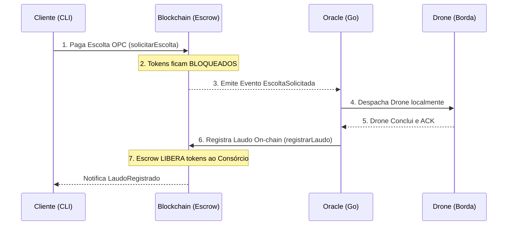
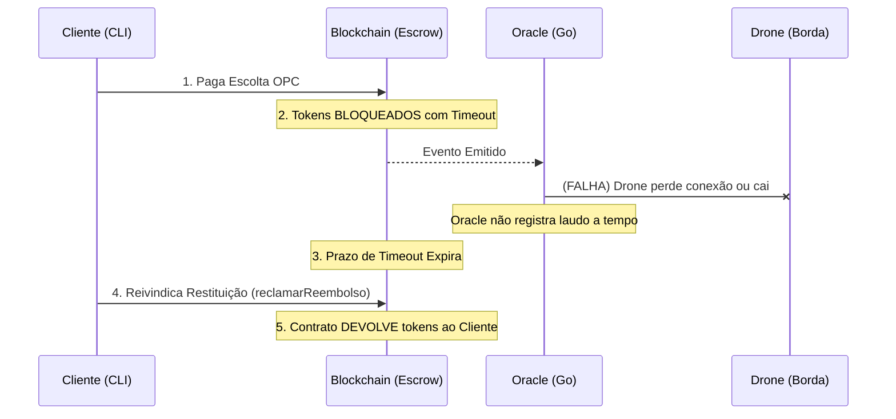

# Arquitetura Web3 e Fluxos Econômicos

Esta documentação detalha as fundações financeiras da plataforma e a máquina de estados que orquestra a custódia das escoltas físicas, garantindo que nem o Cliente e nem o Consórcio (Oracle Go) possam fraudar a operação.

## 1. Economia OPC (Ormuz Protection Coin)
O **OPC** é um token padrão ERC-20 emitido nativamente pelo contrato inteligente e que ancora todas as transações da frota.

* **Emissão**: O deployer (Tesouraria do Consórcio) detém a `MINTER_ROLE` e pode cunhar moedas mediante depósitos fiat (externos).
* **Circulação**: Empresas de Navegação usam o OPC como crédito pré-pago exclusivo para contratar escoltas.
* **Custódia**: Nenhum drone sai do porto sem que a fatura tenha sido honrada, garantindo fluxo de caixa blindado para o Consórcio.

## 2. Fluxo de Escolta (Caminho Feliz / Escrow)
Neste cenário, a infraestrutura da borda e os drones funcionam conforme o planejado. O mecanismo de garantia (Escrow) retém os valores para forçar a entrega do laudo técnico.

## 3. Fluxo de Falha (Reembolso Bizantino)
Neste cenário (Falha de Comunicação, Erro no Oracle ou Drones Abatidos), a janela de tolerância de tempo (*Timeout Block*) expira. O Consórcio perde o direito aos tokens daquela missão, que ficam livres para resgate.

## Benefícios Matemáticos do Paradigma Web3
A junção das restrições de Escrow + Timeout aniquila completamente a categoria de problemas que os algoritmos de consenso acadêmicos tentavam (de forma frágil) contornar:
1. **Evita Double-Spending de Requisições**: Impossível enfileirar uma missão no Hardhat sem pagar antes.
2. **Evita Fraude de Omissão**: O Consórcio jamais receberá pagamento se não efetuar o despacho físico do drone comprovado pelo seu laudo.
3. **Evita Deadlocks Operacionais**: Se houver falha na eleição de servidor ou travamento em redes, a missão é matematicamente declarada falha pela EVM após `N` blocos e a economia gira novamente via Reembolso.
